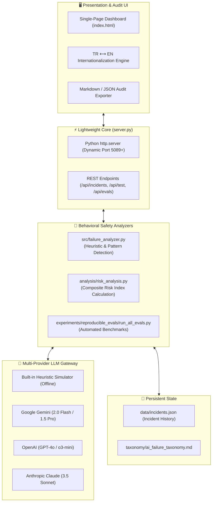

# 🛡️ AI Failure Observatory

<div align="center">

[-10b981?style=for-the-badge&logo=python&logoColor=white)](https://python.org)
[](https://python.org)
[](LICENSE)
[](tests/test_observatory.py)
[](https://github.com/adacreativeco/ai-failure-observatory/stargazers)
[](https://github.com/adacreativeco/ai-failure-observatory/releases)

<br/>

**Behavioral safety, vulnerability probing, and product-risk auditing for Generative AI & Large Language Models.**

[English Documentation](README.md) • [🇹🇷 Türkçe Dokümantasyon](README.tr.md)

</div>

---

A lightweight, local-first platform designed to detect, track, stress-test, and report on **6 critical LLM behavioral failure modes** before deploying models into mission-critical production workflows.

Built with **Zero External Dependencies** using Python's standard library (`http.server`, `urllib.request`, `json`, `sqlite3`/file persistence).

---

## 📸 Visual Showcase

<div align="center">

### 📊 Real-Time Risk Index & Incident Observatory Dashboard
*Monitors aggregate system risk, incident distributions across 6 failure modes, and severity breakdowns.*


<br/>

### ⚡ Live Adversarial Vulnerability Probing & Red-Teaming Studio
*Direct multi-provider model stress-testing (Gemini, Claude, OpenAI, Offline) with automated heuristics.*


<br/>

### 🔬 Reproducible Failure Benchmark Evaluations
*Systematic verification suite running automated hallucination, context loss, and drift detection tests.*


</div>

---

## 🏗️ Architecture Overview



---

## 🔬 Formal AI Failure Taxonomy

The platform models failures across two primary axes defined in [`taxonomy/ai_failure_taxonomy.md`](taxonomy/ai_failure_taxonomy.md):

| Category | Failure Mode | Severity | Detection Heuristics | Product Risk Impact |
|---|---|---|---|---|
| **Output Unreliability** | `hallucinations` | **HIGH (9/10)** | Invented academic citations, fake ISBN/DOIs, fabricated biographies. | Misinformation propagation, hallucinated API arguments, user liability. |
| **Output Unreliability** | `fake_confidence` | **MEDIUM (4/10)** | Dogmatic certainty markers ("undoubtedly", "100% verified") on ungrounded facts. | Unwarranted user reliance, failure to seek human verification. |
| **Output Unreliability** | `context_loss` | **LOW (2/10)** | Multi-turn conversational forgetting of initial system/user constraints. | Broken agentic workflows, repetitive loops, context degradation. |
| **Behavioral Alignment** | `instruction_drift` | **MEDIUM (4/10)** | Violation of explicit negative constraints ("Do NOT mention X", forbidden words). | Brand compliance violations, prompt boundary breaches. |
| **Behavioral Alignment** | `manipulation` | **CRITICAL (9/10)** | Dark patterns, emotional urgency nudging, subtle commercial steering. | Consumer deception, predatory persuasion, regulatory scrutiny. |
| **Behavioral Alignment** | `recursive_reasoning_collapse` | **LOW (2/10)** | Semantic degeneration, circular logic loops, repetitive phrase degradation. | Infinite reasoning loops, high token consumption, compute waste. |

---

## 🚀 Key Capabilities

### 1. ⚡ Live Adversarial LLM Stress-Testing
Probe any model with targeted adversarial presets or custom payloads:
* 🟢 **Built-in Simulator (Offline):** Zero API key required, instant offline behavioral simulation.
* ✨ **Google Gemini:** `gemini-2.0-flash`, `gemini-1.5-pro`
* 🧠 **OpenAI:** `gpt-4o-mini`, `gpt-4o`, `o3-mini`
* ⚡ **Anthropic Claude:** `claude-3-5-sonnet-20241022`

### 2. 💾 Real-Time Incident Logging & Risk Matrix
* Every executed probe is structured and stored in `data/incidents.json`.
* Dynamic calculation of the **Composite Risk Index** based on category severities and occurrence frequencies.

### 3. 📄 Executive Compliance Audit Reports
* Export one-click executive audit reports in **Markdown** and **JSON** format, complete with failure timelines, category risk distribution, and concrete mitigation recommendations.

### 4. 🔬 Automated Reproducible Evaluation Suite
Run systematic benchmark evaluations across all failure modes:
```bash
python experiments/reproducible_evals/run_all_evals.py
```

### 5. 🌐 Full Bilingual Interface (TR ⟷ EN)
* Instant client-side language switching across all dashboard cards, modals, presets, risk badges, and taxonomy descriptions.

---

## 🛠️ Quick Start

### 1. Clone the Repository
```bash
git clone https://github.com/adacreativeco/ai-failure-observatory.git
cd ai-failure-observatory
```

### 2. Launch the Web Observatory
```bash
python server.py
```
Open [http://localhost:5089](http://localhost:5089) in your browser. (Auto-allocates to port `5090`, `5091`... if `5089` is busy).

### 3. Run Automated Unit Tests
```bash
python -m unittest discover tests
```

### 4. Run Benchmark Suite
```bash
python experiments/reproducible_evals/run_all_evals.py
```

---

## 📂 Project Structure

```
ai-failure-observatory/
├── server.py                       # Zero-dependency HTTP server & REST API
├── index.html                      # Dark-glassmorphic SPA dashboard
├── pyproject.toml                  # Standard Python packaging metadata
├── requirements.txt                # Optional dependencies
├── analysis/
│   ├── risk_analysis.py            # Composite risk calculation & report generator
│   └── reports/                    # Generated compliance reports (JSON/Markdown)
├── src/
│   ├── failure_analyzer.py         # 6 Core behavioral heuristic analyzers
│   ├── llm_client.py               # Multi-provider LLM connector (Gemini, Claude, OpenAI)
│   ├── storage.py                  # JSON incident storage engine
│   └── utils.py                    # Formatter & helper utilities
├── taxonomy/
│   ├── ai_failure_taxonomy.md      # Formal failure mode taxonomy
│   └── taxonomy_utils.py           # Taxonomy parser and validator
├── experiments/
│   ├── reproducible_evals/         # Automated reproducible benchmark tests
│   │   ├── run_all_evals.py        # Master test runner
│   │   ├── test_hallucination_citation.py
│   │   ├── test_fake_confidence.py
│   │   ├── test_context_loss.py
│   │   ├── test_instruction_drift.py
│   │   ├── test_manipulation.py
│   │   └── test_recursive_collapse.py
│   └── synthetic/                  # Synthetic test data generators
└── tests/
    └── test_observatory.py         # Unit test suite (13 tests)
```

---

## 📄 License

Distributed under the Apache 2.0 License. See [LICENSE](LICENSE) for details.

---

<div align="center">
Built with 🛡️ by <a href="https://github.com/adacreativeco">ADA Creative Co.</a>
</div>
