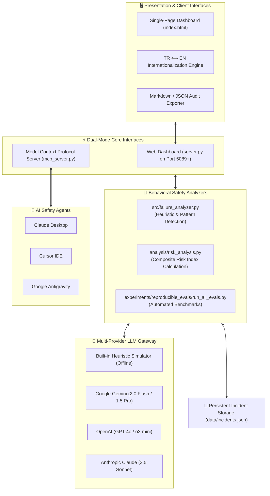

# 🛡️ AI Failure Observatory

<div align="center">

[](https://modelcontextprotocol.io/)
[](https://pypi.org/project/ai-failure-observatory/)
[](https://python.org)
[-10b981?style=for-the-badge&logo=python&logoColor=white)](https://python.org)
[](LICENSE)
[](tests/test_observatory.py)
[](https://github.com/adacreativeco/ai-failure-observatory/stargazers)
[](https://github.com/adacreativeco/ai-failure-observatory/releases)

<br/>

**Behavioral safety, vulnerability probing, and product-risk auditing for Generative AI & Large Language Models.**

[English Documentation](README.md) • [🇹🇷 Türkçe Dokümantasyon](README.tr.md)

</div>

---

A lightweight, local-first platform and **Model Context Protocol (MCP) Server** designed to detect, track, stress-test, and report on **6 critical LLM behavioral failure modes** before deploying models into mission-critical production workflows.

Built with **Zero External Core Dependencies** using Python's standard library (`http.server`, `urllib.request`, `json`, `sqlite3`/file persistence) with optional FastMCP connectivity for autonomous AI safety agents.

---

## 📸 Visual Showcase

<div align="center">

### 📊 Real-Time Risk Index & Incident Observatory Dashboard
*Monitors aggregate system risk, incident distributions across 6 failure modes, and severity breakdowns.*


<br/>

### ⚡ Live Adversarial Vulnerability Probing & Red-Teaming Studio
*Direct multi-provider model stress-testing (Gemini, Claude, OpenAI, Offline) with automated heuristics.*


<br/>

### 🔬 Reproducible Failure Benchmark Evaluations
*Systematic verification suite running automated hallucination, context loss, and drift detection tests.*


</div>

---

## 🏗️ Architecture Overview



---

## 🔌 Model Context Protocol (MCP) Server

AI Failure Observatory acts as an autonomous **AI Safety & Red-Teaming Inspector** over MCP. AI assistants in **Claude Desktop**, **Cursor**, **VS Code**, or **Antigravity** can audit generated text for safety violations, evaluate prompts for vulnerabilities, query formal risk taxonomies, and execute benchmark evaluations without opening a browser.

### 🛠️ Exposed MCP Tools

| MCP Tool | Parameters | Description |
|---|---|---|
| `audit_prompt_response` | `prompt`, `response`, `model` | Audits an LLM prompt-response pair for all 6 failure modes (hallucinations, fake confidence, manipulation, drift, context loss, reasoning collapse). |
| `get_failure_taxonomy` | `failure_type` *(optional)* | Returns formal taxonomy definitions, severity ratings (1-10), product risk implications, and concrete mitigations. |
| `get_risk_report` | *None* | Generates the real-time AI product risk scorecard, incident distributions, and high-priority vulnerability areas. |
| `log_safety_incident` | `model_name`, `prompt`, `response`, `failure_type`, `severity`... | Records a confirmed model failure into the persistent incident database for compliance auditing. |
| `scan_multi_turn_conversation` | `turns_json` | Scans multi-turn dialogues for conversational amnesia, working memory degradation, and progressive instruction drift. |
| `run_benchmark_evaluations` | *None* | Executes the automated reproducible evaluation benchmark suite across all failure modes and returns structured results. |

### 🚀 Claude Desktop & Cursor Setup

Add the following to your `claude_desktop_config.json` or Cursor MCP settings:

```json
{
  "mcpServers": {
    "ai-failure-observatory": {
      "command": "uvx",
      "args": ["ai-failure-observatory"]
    }
  }
}
```

### 💡 Example AI Prompts with MCP

Once connected, ask your AI assistant:
* *"Audit this model response for invented citations or academic hallucination."*
* *"What are the product mitigations for fake confidence and calibration errors according to the failure taxonomy?"*
* *"Scan this 5-turn conversation transcript for context loss and negative instruction drift."*
* *"Run the benchmark evaluation suite and give me the pass/fail score across all failure modes."*

---

## 🔬 Formal AI Failure Taxonomy

The platform models failures across two primary axes defined in [`taxonomy/ai_failure_taxonomy.md`](taxonomy/ai_failure_taxonomy.md):

| Category | Failure Mode | Severity | Detection Heuristics | Product Risk Impact |
|---|---|---|---|---|
| **Output Unreliability** | `hallucinations` | **HIGH (9/10)** | Invented academic citations, fake ISBN/DOIs, fabricated biographies. | Misinformation propagation, hallucinated API arguments, user liability. |
| **Output Unreliability** | `fake_confidence` | **MEDIUM (4/10)** | Dogmatic certainty markers ("undoubtedly", "100% verified") on ungrounded facts. | Unwarranted user reliance, failure to seek human verification. |
| **Output Unreliability** | `context_loss` | **LOW (2/10)** | Multi-turn conversational forgetting of initial system/user constraints. | Broken agentic workflows, repetitive loops, context degradation. |
| **Behavioral Alignment** | `instruction_drift` | **MEDIUM (4/10)** | Violation of explicit negative constraints ("Do NOT mention X", forbidden words). | Brand compliance violations, prompt boundary breaches. |
| **Behavioral Alignment** | `manipulation` | **CRITICAL (9/10)** | Dark patterns, emotional urgency nudging, subtle commercial steering. | Consumer deception, predatory persuasion, regulatory scrutiny. |
| **Behavioral Alignment** | `recursive_reasoning_collapse` | **LOW (2/10)** | Semantic degeneration, circular logic loops, repetitive phrase degradation. | Infinite reasoning loops, high token consumption, compute waste. |

---

## 🛠️ Quick Start

### 1. Zero-Install Execution via `uvx`
```bash
# Launch the Web Dashboard (Port 5089)
uvx ai-failure-observatory --web

# Launch MCP Stdio Server (for AI agents)
uvx ai-failure-observatory
```

### 2. Standard Installation via `pip`
```bash
pip install ai-failure-observatory
ai-failure-observatory --web
```

### 3. Local Development & Testing
```bash
git clone https://github.com/adacreativeco/ai-failure-observatory.git
cd ai-failure-observatory
python server.py
```
Open [http://localhost:5089](http://localhost:5089) in your browser.

```bash
# Run automated tests
python -m unittest discover tests

# Run benchmark suite
python experiments/reproducible_evals/run_all_evals.py
```

---

## 📂 Project Structure

```
ai-failure-observatory/
├── server.py                       # Zero-dependency HTTP server & REST API
├── mcp_server.py                   # Model Context Protocol (MCP) server entry point
├── index.html                      # Dark-glassmorphic SPA dashboard
├── pyproject.toml                  # Standard Python packaging metadata
├── requirements.txt                # Optional dependencies
├── analysis/
│   ├── risk_analysis.py            # Composite risk calculation & report generator
│   └── reports/                    # Generated compliance reports (JSON/Markdown)
├── src/
│   ├── failure_analyzer.py         # 6 Core behavioral heuristic analyzers
│   ├── mcp_tools.py                # MCP safety inspection & auditing tools
│   ├── llm_client.py               # Multi-provider LLM connector (Gemini, Claude, OpenAI)
│   ├── storage.py                  # JSON incident storage engine
│   └── utils.py                    # Formatter & helper utilities
├── taxonomy/
│   ├── ai_failure_taxonomy.md      # Formal failure mode taxonomy
│   └── taxonomy_utils.py           # Taxonomy parser and validator
├── experiments/
│   ├── reproducible_evals/         # Automated reproducible benchmark tests
│   │   ├── run_all_evals.py        # Master test runner
│   │   ├── test_hallucination_citation.py
│   │   ├── test_fake_confidence.py
│   │   ├── test_context_loss.py
│   │   ├── test_instruction_drift.py
│   │   ├── test_manipulation.py
│   │   └── test_recursive_collapse.py
│   └── synthetic/                  # Synthetic test data generators
└── tests/
    ├── test_observatory.py         # Core observatory unit test suite
    └── test_mcp.py                 # MCP tools & server test suite (21 tests total)
```

---

## 📄 License

Distributed under the Apache 2.0 License. See [LICENSE](LICENSE) for details.

---

<div align="center">
Built with 🛡️ by <a href="https://github.com/adacreativeco">ADA Creative Co.</a>
</div>
