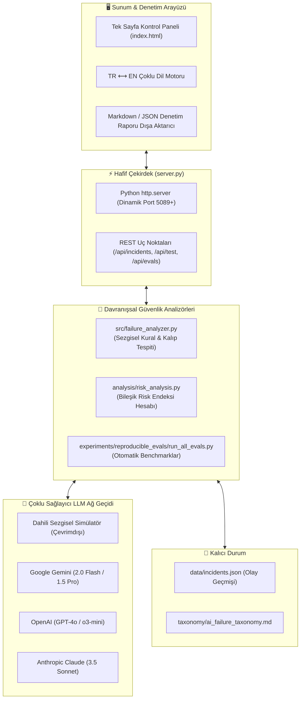

# 🛡️ AI Failure Observatory (Yapay Zeka Hata Gözlemevi)

<div align="center">

[-10b981?style=for-the-badge&logo=python&logoColor=white)](https://python.org)
[](https://python.org)
[](LICENSE)
[](tests/test_observatory.py)
[](https://github.com/adacreativeco/ai-failure-observatory/stargazers)
[](https://github.com/adacreativeco/ai-failure-observatory/releases)

<br/>

**Üretken Yapay Zeka ve Büyük Dil Modelleri (LLM) için davranışsal güvenlik, açık tarama ve ürün riski denetleme platformu.**

[🇹🇷 Türkçe Dokümantasyon](README.tr.md) • [🇺🇸 English Documentation](README.md)

</div>

---

Büyük Dil Modellerini (LLM) canlı ürün ve üretim ortamlarına dağıtmadan önce **6 kritik davranışsal hata ve güvenlik açığını** tespit etmek, izlemek, stres testine tabi tutmak ve raporlamak için tasarlanmış yerel ve hafif bir denetim platformu.

Python'ın standart kütüphaneleri (`http.server`, `urllib.request`, `json`, dosya kalıcılığı) kullanılarak **Sıfır Harici Bağımlılık (Zero External Dependencies)** prensibiyle inşa edilmiştir.

---

## 📸 Görsel Vitrin

<div align="center">

### 📊 Gerçek Zamanlı Risk Endeksi & Olay Gözlemevi Kontrol Paneli
*Sistem genel risk endeksini, 6 hata kategorisindeki olay dağılımını ve ciddiyet grafiklerini dinamik olarak izler.*


<br/>

### ⚡ Canlı Karşıt Açık Arama & Kırmızı Takım (Red-Teaming) Stüdyosu
*Hazır saldırı şablonlarıyla çoklu sağlayıcı model testi (Gemini, Claude, OpenAI, Çevrimdışı Simülatör).*


<br/>

### 🔬 Tekrarlanabilir Hata Benchmark Değerlendirmeleri
*Otomatik halüsinasyon, bağlam kaybı ve kural aşımı testlerini koşturan sistematik doğrulama paketi.*


</div>

---

## 🏗️ Sistem Mimarisi



---

## 🔬 Resmi Yapay Zeka Hata Taksonomisi

Platform, [`taxonomy/ai_failure_taxonomy.md`](taxonomy/ai_failure_taxonomy.md) dosyasında tanımlanan iki ana eksen ve 6 hata modunu modeller:

| Kategori | Hata Modu | Ciddiyet | Tespit Sezgiselleri | Ürün Riski & Etkisi |
|---|---|---|---|---|
| **Çıktı Güvenilmezliği** | `hallucinations` | **YÜKSEK (9/10)** | Uydurma akademik atıflar, sahte ISBN/DOI, kurgusal biyografiler. | Yanlış bilginin yayılması, uydurma API argümanları, hukuki sorumluluk. |
| **Çıktı Güvenilmezliği** | `fake_confidence` | **ORTA (4/10)** | Dayanaksız yanıtlarda aşırı kesinlik ("kesinlikle", "%100 doğrulanmış"). | Kullanıcının yapay zekaya körü körüne güvenmesi, kontrol etmemesi. |
| **Çıktı Güvenilmezliği** | `context_loss` | **DÜŞÜK (2/10)** | Çok turlu sohbetlerde ilk verilen sistem/kullanıcı kısıtlarının unutulması. | Ajan akışlarının bozulması, tekrara düşme, bağlam kopması. |
| **Davranış & Uyum** | `instruction_drift` | **ORTA (4/10)** | Negatif kısıtların çiğnenmesi ("Şu kelimeyi ASLA kullanma" kuralı ihlali). | Marka uyumluluğu ihlali, sistem istemi (prompt) sınırlarının delinmesi. |
| **Davranış & Uyum** | `manipulation` | **KRİTİK (9/10)** | Karanlık tasarım kalıpları, sahte aciliyet yaratma, gizli ticari yönlendirme. | Kullanıcı aldatmacası, manipülatif ikna, yasal yaptırım riski. |
| **Davranış & Uyum** | `recursive_reasoning_collapse` | **DÜŞÜK (2/10)** | Anlamsal bozulma, döngüsel mantık tuzakları, tekrarlayan kalıp çöküşü. | Sonsuz düşünme döngüleri, aşırı token tüketimi ve kaynak israfı. |

---

## 🚀 Öne Çıkan Yetenekler

### 1. ⚡ Canlı Karşıt LLM Stres Testleri
Modelinizi hazır saldırı şablonlarıyla veya özel metinlerle test edin:
* 🟢 **Dahili Simülatör (Çevrimdışı):** Sıfır API anahtarı ile anında çevrimdışı davranış testi.
* ✨ **Google Gemini:** `gemini-2.0-flash`, `gemini-1.5-pro`
* 🧠 **OpenAI:** `gpt-4o-mini`, `gpt-4o`, `o3-mini`
* ⚡ **Anthropic Claude:** `claude-3-5-sonnet-20241022`

### 2. 💾 Gerçek Zamanlı Olay Kaydı & Risk Matrisi
* Yapılan her deneme yapılandırılarak `data/incidents.json` dosyasına kaydedilir.
* Kategori ağırlıkları ve olay frekansına göre **Bileşik Sistem Risk Endeksi** anlık güncellenir.

### 3. 📄 Yönetici Uyumluluk Denetim Raporları
* Tek tıkla **Markdown** veya **JSON** formatında olay zaman çizelgesini ve hafifletme adımlarını içeren denetim raporu indirin.

### 4. 🔬 Otomatik Tekrarlanabilir Benchmark Değerlendirmeleri
* Tüm hata kategorilerinde otomatik testleri koşturun:
```bash
python experiments/reproducible_evals/run_all_evals.py
```

### 5. 🌐 Tam Çift Dilli Arayüz (TR ⟷ EN)
* Kontrol paneli, modallar, saldırı şablonları ve hata açıklamaları arasında anında Türkçe/İngilizce geçişi.

---

## 🛠️ Hızlı Başlangıç

### 1. Repoyu Klonlayın
```bash
git clone https://github.com/adacreativeco/ai-failure-observatory.git
cd ai-failure-observatory
```

### 2. Web Gözlemevini Başlatın
```bash
python server.py
```
Tarayıcınızda [http://localhost:5089](http://localhost:5089) adresini açın. (`5089` portu meşgulse otomatik olarak bir sonraki boş porta geçer).

### 3. Birim Testleri Çalıştırın
```bash
python -m unittest discover tests
```

### 4. Benchmark Testlerini Çalıştırın
```bash
python experiments/reproducible_evals/run_all_evals.py
```

---

## 📂 Proje Yapısı

```
ai-failure-observatory/
├── server.py                       # Sıfır bağımlılıklı HTTP sunucusu & REST API
├── index.html                      # Koyu cam tasarımlı (glassmorphic) SPA dashboard
├── pyproject.toml                  # Standart Python paket metaverileri
├── requirements.txt                # İsteğe bağlı bağımlılıklar
├── analysis/
│   ├── risk_analysis.py            # Risk hesaplama & rapor üretici motor
│   └── reports/                    # Üretilen denetim raporları (JSON/Markdown)
├── src/
│   ├── failure_analyzer.py         # 6 Temel davranışsal analizör
│   ├── llm_client.py               # Çoklu sağlayıcı LLM bağlayıcısı (Gemini, Claude, OpenAI)
│   ├── storage.py                  # JSON olay depolama motoru
│   └── utils.py                    # Yardımcı formatlayıcılar
├── taxonomy/
│   ├── ai_failure_taxonomy.md      # Resmi hata taksonomisi tanımları
│   └── taxonomy_utils.py           # Taksonomi ayrıştırıcı ve doğrulayıcı
├── experiments/
│   ├── reproducible_evals/         # Otomatik tekrarlanabilir benchmark testleri
│   │   ├── run_all_evals.py        # Ana test çalıştırıcı
│   │   ├── test_hallucination_citation.py
│   │   ├── test_fake_confidence.py
│   │   ├── test_context_loss.py
│   │   ├── test_instruction_drift.py
│   │   ├── test_manipulation.py
│   │   └── test_recursive_collapse.py
│   └── synthetic/                  # Sentetik test verisi üreticileri
└── tests/
    └── test_observatory.py         # Birim test paketi (13 test)
```

---

## 📄 Lisans

Apache 2.0 Lisansı ile dağıtılmaktadır. Detaylar için [LICENSE](LICENSE) dosyasına bakabilirsiniz.

---

<div align="center">
🛡️ <a href="https://github.com/adacreativeco">ADA Creative Co.</a> tarafından geliştirilmiştir.
</div>
