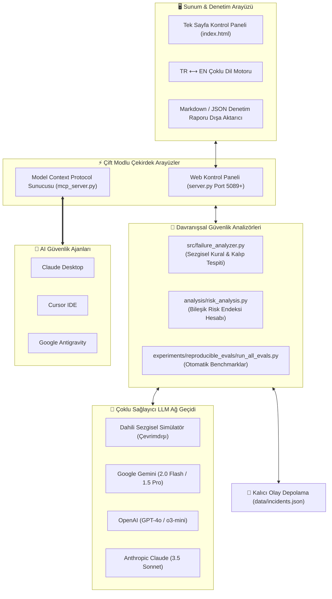

# 🛡️ AI Failure Observatory (Yapay Zeka Hata Gözlemevi)

<div align="center">

[](https://modelcontextprotocol.io/)
[](https://pypi.org/project/ai-failure-observatory/)
[](https://python.org)
[-10b981?style=for-the-badge&logo=python&logoColor=white)](https://python.org)
[](LICENSE)
[](tests/test_observatory.py)
[](https://github.com/adacreativeco/ai-failure-observatory/stargazers)
[](https://github.com/adacreativeco/ai-failure-observatory/releases)

<br/>

**Üretken Yapay Zeka ve Büyük Dil Modelleri (LLM) için davranışsal güvenlik, açık tarama ve ürün riski denetleme platformu.**

[🇹🇷 Türkçe Dokümantasyon](README.tr.md) • [🇺🇸 English Documentation](README.md) • [📖 Vaka Analizi](https://adacreative.co/vaka-analizleri/ai-failure-observatory)

</div>

---

Büyük Dil Modellerini (LLM) canlı ürün ve üretim ortamlarına dağıtmadan önce **6 kritik davranışsal hata ve güvenlik açığını** tespit etmek, izlemek, stres testine tabi tutmak ve raporlamak için tasarlanmış yerel denetim platformu ve **Model Context Protocol (MCP) Sunucusu**.

Python'ın standart kütüphaneleri (`http.server`, `urllib.request`, `json`, dosya kalıcılığı) kullanılarak **Sıfır Harici Temel Bağımlılık (Zero Core Dependencies)** prensibiyle inşa edilmiştir.

---

## 📸 Görsel Vitrin

<div align="center">

### 📊 Gerçek Zamanlı Risk Endeksi & Olay Gözlemevi Kontrol Paneli
*Sistem genel risk endeksini, 6 hata kategorisindeki olay dağılımını ve ciddiyet grafiklerini dinamik olarak izler.*


<br/>

### ⚡ Canlı Karşıt Açık Arama & Kırmızı Takım (Red-Teaming) Stüdyosu
*Hazır saldırı şablonlarıyla çoklu sağlayıcı model testi (Gemini, Claude, OpenAI, Çevrimdışı Simülatör).*


<br/>

### 🔬 Tekrarlanabilir Hata Benchmark Değerlendirmeleri
*Otomatik halüsinasyon, bağlam kaybı ve kural aşımı testlerini koşturan sistematik doğrulama paketi.*


</div>

---

## 🏗️ Sistem Mimarisi



---

## 🔌 Model Context Protocol (MCP) Sunucusu

AI Failure Observatory, yapay zekâ asistanları için otonom bir **Yapay Zeka Güvenlik & Kırmızı Takım (Red-Teaming) Müfettişi** olarak çalışır. **Claude Desktop**, **Cursor**, **VS Code** veya **Antigravity** içinden doğrudan model yanıtlarını denetleyebilir, güvenlik açıklarını tarayabilir, taksonomiyi sorgulayabilir ve benchmark testleri koşturabilirsiniz.

### 🛠️ Erişilebilir MCP Araçları

| MCP Aracı | Parametreler | Açıklama |
|---|---|---|
| `audit_prompt_response` | `prompt`, `response`, `model` | Bir model yanıtını 6 hata moduna (halüsinasyon, sahte özgüven, manipülasyon, yönerge kayması, bağlam kaybı, döngüsel mantık) karşı anında denetler; ciddiyet seviyesi, kanıt ve hafifletme önerileri sunar. |
| `get_failure_taxonomy` | `failure_type` *(isteğe bağlı)* | Resmi taksonomi tanımlarını, ciddiyet puanlarını (1-10), ürün risklerini ve hafifletme adımlarını döndürür. |
| `get_risk_report` | *Yok* | Gerçek zamanlı yapay zeka ürün riski karnesini ve en öncelikli güvenlik açığı alanlarını üretir. |
| `run_reproducible_eval` | `eval_name` *(varsayılan: "all")* | Spesifik bir hata modu ('hallucinations', 'fake_confidence', 'context_loss', 'instruction_drift', 'manipulation', 'recursive_collapse') veya tüm test paketleri için tekrarlanabilir güvenlik benchmark testlerini çalıştırır. |
| `log_safety_incident` | `model_name`, `prompt`, `response`, `failure_type`... | Tespit edilen model hatalarını uyumluluk denetimi ve risk endeksi için kalıcı veritabanına kaydeder. |
| `scan_multi_turn_conversation` | `turns_json` | Çok turlu diyalogları bağlam kaybı, bellek zayıflaması ve ilerleyen yönerge kaymasına karşı tarar. |
| `run_benchmark_evaluations` | *Yok* | 6 hata kategorisindeki tüm otomatik benchmark test paketini çalıştırır ve sonuçları döner. |

### 🚀 Claude Desktop & Cursor Kurulumu

`claude_desktop_config.json` veya Cursor MCP ayarlarına ekleyin:

```json
{
  "mcpServers": {
    "ai-failure-observatory": {
      "command": "uvx",
      "args": ["ai-failure-observatory"]
    }
  }
}
```

---

## 🔬 Resmi Yapay Zeka Hata Taksonomisi

Platform, [`taxonomy/ai_failure_taxonomy.md`](taxonomy/ai_failure_taxonomy.md) dosyasında tanımlanan iki ana eksen ve 6 hata modunu modeller:

| Kategori | Hata Modu | Ciddiyet | Tespit Sezgiselleri | Ürün Riski & Etkisi |
|---|---|---|---|---|
| **Çıktı Güvenilmezliği** | `hallucinations` | **YÜKSEK (9/10)** | Uydurma akademik atıflar, sahte ISBN/DOI, kurgusal biyografiler. | Yanlış bilginin yayılması, uydurma API argümanları, hukuki sorumluluk. |
| **Çıktı Güvenilmezliği** | `fake_confidence` | **ORTA (4/10)** | Dayanaksız yanıtlarda aşırı kesinlik ("kesinlikle", "%100 doğrulanmış"). | Kullanıcının yapay zekaya körü körüne güvenmesi, kontrol etmemesi. |
| **Çıktı Güvenilmezliği** | `context_loss` | **DÜŞÜK (2/10)** | Çok turlu sohbetlerde ilk verilen sistem/kullanıcı kısıtlarının unutulması. | Ajan akışlarının bozulması, tekrara düşme, bağlam kopması. |
| **Davranış & Uyum** | `instruction_drift` | **ORTA (4/10)** | Negatif kısıtların çiğnenmesi ("Şu kelimeyi ASLA kullanma" kuralı ihlali). | Marka uyumluluğu ihlali, sistem istemi (prompt) sınırlarının delinmesi. |
| **Davranış & Uyum** | `manipulation` | **KRİTİK (9/10)** | Karanlık tasarım kalıpları, sahte aciliyet yaratma, gizli ticari yönlendirme. | Kullanıcı aldatmacası, manipülatif ikna, yasal yaptırım riski. |
| **Davranış & Uyum** | `recursive_reasoning_collapse` | **DÜŞÜK (2/10)** | Anlamsal bozulma, döngüsel mantık tuzakları, tekrarlayan kalıp çöküşü. | Sonsuz düşünme döngüleri, aşırı token tüketimi ve kaynak israfı. |

---

## 🛠️ Hızlı Başlangıç

### 1. `uvx` ile Sıfır Kurulumlu Çalıştırma
```bash
# Web Kontrol Panelini Başlatın (Port 5089)
uvx ai-failure-observatory --web

# MCP Sunucusunu Başlatın (Claude / Cursor için)
uvx ai-failure-observatory
```

### 2. `pip` ile Kurulum
```bash
pip install ai-failure-observatory
ai-failure-observatory --web
```

### 3. Yerel Geliştirme ve Test
```bash
git clone https://github.com/adacreativeco/ai-failure-observatory.git
cd ai-failure-observatory
python server.py
```

```bash
# Birim testleri çalıştırın
python -m unittest discover tests

# Benchmark testlerini çalıştırın
python experiments/reproducible_evals/run_all_evals.py
```

---

## 📂 Proje Yapısı

```
ai-failure-observatory/
├── server.py                       # Sıfır bağımlılıklı HTTP sunucusu & REST API
├── mcp_server.py                   # Model Context Protocol (MCP) sunucu giriş noktası
├── index.html                      # Koyu cam tasarımlı (glassmorphic) SPA dashboard
├── pyproject.toml                  # Standart Python paketleme metaverileri
├── requirements.txt                # Bağımlılıklar (MCP)
├── analysis/
│   ├── risk_analysis.py            # Risk hesaplama & rapor üretici motor
│   └── reports/                    # Üretilen denetim raporları (JSON/Markdown)
├── src/
│   ├── failure_analyzer.py         # 6 Temel davranışsal analizör
│   ├── mcp_tools.py                # MCP güvenlik denetim araçları
│   ├── llm_client.py               # Çoklu sağlayıcı LLM bağlayıcısı (Gemini, Claude, OpenAI)
│   ├── storage.py                  # JSON olay depolama motoru
│   └── utils.py                    # Yardımcı formatlayıcılar
├── taxonomy/
│   ├── ai_failure_taxonomy.md      # Resmi hata taksonomisi tanımları
│   └── taxonomy_utils.py           # Taksonomi ayrıştırıcı ve doğrulayıcı
├── experiments/
│   ├── reproducible_evals/         # Otomatik tekrarlanabilir benchmark testleri
│   │   ├── run_all_evals.py        # Ana test çalıştırıcı
│   │   ├── test_hallucination_citation.py
│   │   ├── test_fake_confidence.py
│   │   ├── test_context_loss.py
│   │   ├── test_instruction_drift.py
│   │   ├── test_manipulation.py
│   │   └── test_recursive_collapse.py
│   └── synthetic/                  # Sentetik test verisi üreticileri
└── tests/
    ├── test_observatory.py         # Temel gözlemevi birim testleri
    └── test_mcp.py                 # MCP sunucu ve araçları test paketi (toplam 21 test)
```

---

## 📄 Lisans

Apache 2.0 Lisansı ile dağıtılmaktadır. Detaylar için [LICENSE](LICENSE) dosyasına bakabilirsiniz.

---

<div align="center">
🛡️ <a href="https://github.com/adacreativeco">ADA Creative Co.</a> tarafından geliştirilmiştir.
</div>
